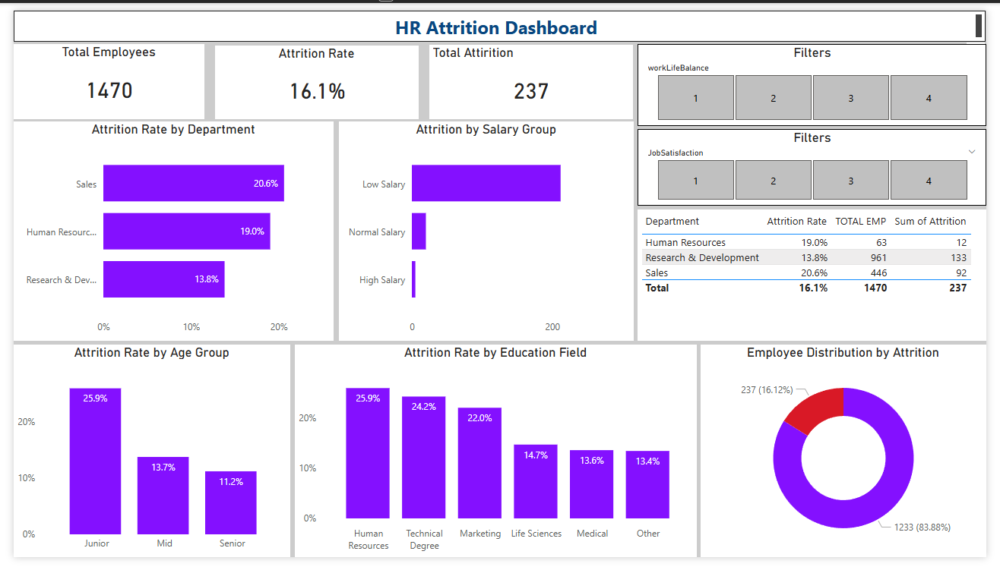

##HR Attrition Dashboard (Power BI)
Overview
This project is a Power BI dashboard designed to analyze employee attrition and identify key factors affecting employee turnover.

## Key Insights
Total Employees: 1470
Attrition Rate: 16.1%
Total Attrition: 237

## Dashboard Features
Attrition Rate by Department
Attrition Analysis by Salary Group
Age Group-wise Attrition Trends
Education Field Impact on Attrition
Employee Distribution (Attrition vs Retention)
Interactive Filters (Work-Life Balance, Job Satisfaction)

## Tools Used
Power BI
DAX
Data Modeling

## Dashboard Preview

